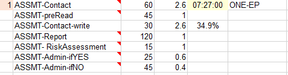
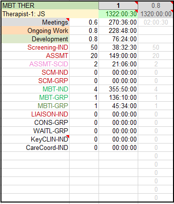
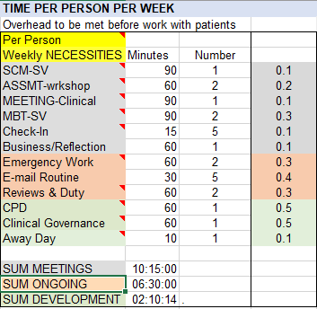
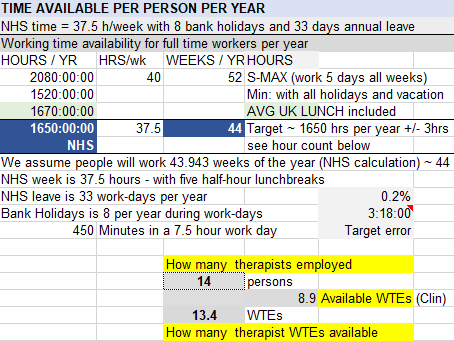

The model reflects work of a PD unit that provides mainly psychological interventions. The model consists of a spreadsheet (can work either in Excel or LibreOffice Calc). The model is documented in this `README.md` file. There is also going to be a visualization of the capacity done as a pipe-throughput model in R. 

## Principles

1. Express everything in easy to grasp time units. Make only simple changes such as changing number of minutes of an intervention component or number of times such component is needed in one cycle of intervention. Allow the spredsheet mechanism to propagate the changes across the whole spreadsheet.
	1.1. _You only change number of minutes and number of times_. Do not change cells with time format, or formulas.
2. Everybody has a specific amount of working time available per year. Capacity is also measured in how many people can be served per year given the MDT members we have.
3. This model works for small teams (2 to 17 people) who directly work with the patients. It can be upscaled to larger teams, but perhaps more than 30 would become unwieldy. However it could work if we had some "generic" workers - i.e. their expected work would be the same - say provide 30 episodes of SCM and 30 assessments per year. Then we could record that we employ 2 such therapists and multiply the results.
4. The timings of interventions are first assessed by the author and then opinions of clinicians are sought both individually and at team away days. Results are a pretty good estimate how much time each intervention will take on average.
5. The overhead time associated with each clinician is looked at on _per-week_ basis - as this is time easy to understand. Meetings and such things are usually well understood weekly. Later in the individual clinican boxes the weekly amount is multiplied by the available hours variable. 

## Parts

Description of parts of the model. Many cells contain a tiny red triangle in the top-right corner. That is a note you can see hovering the mouse over the triangle. Notes were mostly taken during the team discussion process in the away-day and reflect why we had to choose those numbers. Further notes were added to document functional parts of the spreadsheet. 

### Intervention box

Top left cell - "Individual Factor" for SCM - how many clinicians it takes to conduct this activity.

List of component activities. Names are hoped to be short and self - explanatory:

* `ASSMT-Contact` - direct contact with the patient. Preferably F2F. 60 minutes. 2.6 times per assessment. (We see people for 2 to 3 sessions per assessment - slightly more 3 than 2 - hence 2.6 times on average)
* `ASSMT-preRead` - we have to read documentation and notes before we see the patient. 45 minutes, once per assessment. (In complex cases may take more)
* `ASSMT-Contact-write` - after the contact we will need to open RiO and write the clinical note. 30 minutes, happens same number of times as we see the patient.
* `ASSMT-Report` - after we are done with the assessment we need to put together a report (includes diagnosis, basis for diagnosis, risk and comprehensive history). Without a report a proper assessment has not happened. 2 hours, once per assessment.
* `ASSMT- RiskAssessment` - we have to open RiO and deal with a cumbersome form. Preferably copy-paste risk summary and plan from the report, but it still will take time. RA is a must. 15 minutes, once per assessment.
* `ASSMT-Admin-ifYES` - includes clustering, clinical coding, moving to appropriate part of the waiting lists and letters. It is always easier to say "Yes, we take the patient" (which happens in ~ 60% of cases). 25 minutes (if we have admin support), once.
* `ASSMT-Admin-ifNO` Saying no is always more complex, need to say why and suggest alternatives. 45 minutes, once.

Intervention time is tallied in the light yellow cell in the first row. Formula is: `=SUMPRODUCT(C19:C25,D19:D25)/1440` - which means sum of horizontal multiplication products divided by 1440. Here we have 0.310416667 days which translates to 07:27:00 (seven hours and 27 minutes). Dividing the sum of minutes by 1440 we get days as there are that number of minutes within 24 hours. The decimal number is then formatted as time (Custom format `[hh]:mm:ss`).

Below the intervention time we can see the percentage of time that is spent on direct interaction with the patient. It comes comparing the contact time (for some interventions it includes also telephone calls) with the total time spent on the activity.

Finally to the right of the yellow cell there is a classificator of what kind of episode this is. This is a single episode. Types are not very developed, at present there are: ONE-EP = discrete episode; ONE-EP-YEAR means single episode in a year (e.g. MBT); YEARLY = slow open group type work (patients can come in and out any time).

### Clinician time box

 

#### Two Header rows:

* Two top left cells - green and yellow - identify the clinician type and the clinician. 
* Top middle cell identifies the number of times we employ this clinician. Here it says 1 meaning this person is employed (this tallies then to "How many therapists employed" box.). It could say 0 - meaning this clinician is not actively employed now - i.e. position is vacant, maternity leave (uncovered), long term sickness etc. It could be also 2 or more. would mean we are employing more - e.g.than one clinician with the same kind of workload. This could be good for larger teams.
* Top right cell identifies how many FTEs the person is working at. For example here 0.8 means 4 days a week. Full-time would be 1. It has direct bearing to how many hours the clinician is available to work for the Trust. This time is displayed in grey in the cell just below the top right cell.
* Bright green cell in the middle `HOUR TALLY` - identifies how many hours the clinician's working time are we planning to use. This is sum from the column below it. If we plan to underutilize the available hours the cell turns yellow, if we plan to give more hours than available, the cell turns red (this is achieved by conditional formatting). Tolerance factor for colour changes is 0.2% - i.e. at the moment we are "overworking" this therapist for only 2 hours per year, therefore cell is still green, indicating good planning. Point two % were chosen because they are roughly 3 hours one way or the other.

#### Three Overhead rows:

Summarize various overhead activities that are associated with work. This is the time gone before any group or individual work is undertaken. Further described in `Weekly Overhead` section. 

* Meetings. Here we can see that the therapist attends 0.6 meetings (some go because therapist is employed at 0.8 and then she chooses to omit some more). Nevertheless the meetings occupy 270:36:00 working hours of her working year. 
* Ongoing work - not associated with her direct patient activities. This is work done ad hoc - e.g. responding to emergencies (suicidality, sudden disruptions, etc.), email routine (probably underestimated as 30 min per day), reviews and duty work. This amounts to 6 hours and 30 minutes per week and in case of 0.8 employment is 228:48:00 hours per year.
* Development time - 76:24:00 per year. This would consist of audit activity, CPD training, mandatory training, and one away day per year. Estimated at 2 hours and 10 minutes per week, probably contracts say it should be more, but in practice this time more often is taken by relentless clinical activity. In case of this therapist at 0.8 employment it amounts to 76:24:00 hours per year.
* Right pale-grey cell. This is the third cell down and is followed by two blank cells below it. It shows the difference between the hours available and the hours we intend to give to this therapist. If we are "underworking" the therapist i.e. HOUR TALLY is yellow are less than her available hours, the result here is 0. If we are planning to overwork the therapist, this cell shows precise difference between tallied planned hours and her available hours per year. This way we can estimate which activities to reduce the number of - to get the HOUR TALLY green again.

#### Clinical Activity rows:

* Fairly simple. First column is the activity name, the second column - number of times we wish the clinican to carry out this activity per year, then the time this is going to take is calculated and displayed immediately. This third cell is where the complexity lies. **You should edit the second column only**, never the third or fourth.
* Complexity of the third column: If you look into the row for assessments you can see the time is displayed as`=I35*indASSMT_E`. What it means is: take the number of assessments per year we plan for this therapist (20) stored in the cell `I35` and multiply by the value in the named cell `indASSMT_E` (stands for individual assessment episode). That name refers to the yellow time tally cell in the assessment intervention box (as seen above). This way - if you change any assessment component - by adding/removing component bits or changing time for any of them, the value in `indASSMT_E` cell changes - AND this change is immediately reflected across the whole model. For this therapist her assessment time per year would change and her total number of hours planned to work would change immediately, should we change the assessment intervention. Same goes for all other therapists and time totals for the team as well.
* The fourth column is used to provide output for how many interventions of each type are undertaken at the team level. It multiplies the number of interventions we plan for this therapist (column two) by the number of times we emply this kind of therapist (top middle cell of clinican header rows). 
	- The only exception is the SHO doctor - here we multiply also by 2. That is because the SHO changes twice a year. It is easier for us to plan activities for an individual SHO for 6 months, but at the team level we want to know the output for the year from that employment position.

### Weekly Overhead time

There is time that is required of each clinican before any work with the patients can happen. This is a very important factor because it affects _all_ the clinicians. Some individual variation can be achieved in `Clinician time boxes`.  

* First column contains names of what is done. Colour coded and time per week summary in the bottom three rows.
* Second column is the number of minutes each activity takes. 
* Third column is how many times something is done per week. For meetings it is precise, for emergency work and development - estimates.
* Fourth column is percentage (expressed in decimal e.g. 10% = 0.1) of this activity of the total time this group takes per week. This is done so that if we decide this person will come to only one MBT supervision per week, we can estimate by how much to reduce their meetings overhead in their individual `Clinician time boxes`

#### Overhead sum rows

These display total time per week if one undertakes all the meetings and other overhead per week. Some explanation is in order.

#### Meeting overheads

> Mostly clinical meetings.

* **SCM supervision** 1.5 hours Tuesday morning. Vital space to bring problems of the quite risky SCM intervention to team supervision.
* **Assessment workshop** 1 hour twice a week (2 PM). Where to bring assessment queries and present assessed patients. Seniors need to be present. Important meetings since they determine whether we take patients or not. There is a thought that we might take on MAP assessment workshop model which might be a bit more streamlined.
* **Team Clinical meeting** main meeting per week; 1.5 hours. All need to be present.
* **MBT supervison** 1.5 hours twice a week - to ensure MBT treatment runs well. As important as SCM supervision, but situation is often safer as patients engaged in a longer term therapeutic relationship.
* **Check-in** 15 minutes every morning. Used to be in-person, now is mostly via Zoom. For people to tell what they will be doing during the day, where they will be, who is on duty, if they need any help. Strong tradition, but downside may be that attention might be fragmented and quite often they can extend to 20 even 30 minutes. Sometimes people post what they will be doing in the team WhatsApp and do not come to the check-in.
* **Business and Reflective Practice meetings** - 1 hour alternate weeks. Not fully certain is 1 of each is enough per month.

#### Ongoing work overheads

* **Emergency work** - with our clients we can expect that there will be emergencies to be dealt with, sometimes it is our patients, sometimes helping other clinicians or the duty clinician. Everyone can expect to have about 2 hours per week budgeted for that.
* **e-Mail routine** - 30 minutes a day - it probably is a significant underestimate of how much time people are to spend on e-mail. It is a source of a lot of ad-hoc, asynchronous communication and attention disruption. People who have worked in other trusts say that BEH e-mail culture is really difficult and often comes with expectation similar to instant messaging. A proposal would be to check the inbox once a day at the end of the day for half an hour. Not everyone can be happy with this.
* **Reviews & Duty**  - 2 hours per week. Availability to other clinicians for SCM reviews, joint reviews and joint assessments.
Duty work can be quite unpredictable, but generally main work is emptying of duty inbox / referrals inbox and picking up phone messages and speaking to relevant clinicians. Duty frequency is about once every 2 weeks - a frequent occurrence and we need to see if the amount of hours here reflects the time right. If we had data about duty work, that would be good; we could make a duty questionnaire where people quantify their work done for duty at the end of their duty day. 

#### Development work overheads

* **Continued Professional Development** - contractually this should happen in the work time. Estimate 1 h per week, very likely does not happen due to clinical work pressure. Should include any training, reading, mandatory training. 
* **Clinical governance** - work on audit, otcome data collection and interpretation, receiving supervision. Estimate 1 h per week, very likely often does not happen.
* **Away day** - one away day per year translates to 10 minutes all 44 weeks when at work. And important event for team cohesion and deciding the way forward. 

### Time Available Per Year - a general box

Top part should be self-explanatory. The most important part is in NHS-blue - hours available for a full-time NHS worker per year.

Bottom part shows how many therapist-persons (e.g. 15) we have employed and how many WTEs (whole time equivalent - i.e. work hours) this amounts to (e.g. 13.4). This comes from this spreadsheet summing up 2 top right cells from individual clinician boxes. Available WTEs (Clin) show that not all emplyoed clinicans have full time availability to engage with clinical work (e.g. Leads have other management work as do doctors and community transformation workers). Therefore WTEs available to do clinical work at Personality Disorders Pathway is less than employed WTEs - e.g. 8.9.

===
BELOW THIS THE INFORMATION IS VERY MUCH WORK IN PROGRESS:  

## How time is displayed

It is hard to make sense from complex data, therefore data should be displayed in an easy to read and perceive format. This is how we trasform _minutes_ to hourly display. `hh:mm:ss` 

a) we divide the minutes by 1440 because there are 1440 minutes within 24 hours.
b) we set the cell to be formatted as custom time `[hh]:mm:ss`. This way we display hours if we have more hours than 24 (otherwise the usual time format would null the hours as soon as they are greater than 24).
c) note how the time is stored in Excel - it is a decimal number - also known as `serial number` or `serial date`. If you wish to know more about it - google, or read on [Lifewire](https://www.lifewire.com/serial-number-serial-date-3123991#toc-times-stored-as-decimals). Point c explains point b.
d) we can add these numbers and reliably get totals of hours and minutes

## Variable names (named cells)

Using cell names it is possible to avoid a lot of the mess with absolute and relative cell addressing. The most important names are like: `availableWeeks` or `availableHours` - how many weeks and hours a year are available to a full time worker. If the worker is employed part time then the numbers can easily be modified (for 4 days a week work coefficient is 0.8 and so on).

### All named cells:

* `availableFTE` - available FTE  in 'Res-Demand' sheet 
* `availableHours` - available total work hours per year in 'Work-Time' sheet 
* `availableWeeks` - available total work weeks per year in 'Work-Time' sheet 
* `avgUKHours` - not used - is there just to 8 hour days (lunchbreak not subtracted) in 'Work-Time' sheet
* `clinCONSgrp`	='Work-Time'!$X$12
clinMBTgrp	='Work-Time'!$X$8
clinMBTIgrp	='Work-Time'!$X$11
clinSCMgrp	='Work-Time'!$X$16
clinWAITLgrp	='Work-Time'!$X$13
contractFTE	='Res-Demand'!$C$24
demASSMT	='Res-Demand'!$C$5
demASSMT_SCID	='Res-Demand'!$C$6
demASSMTTot	='Res-Demand'!$A$5
demCC	='Res-Demand'!$C$17
demCONS_GRP	='Res-Demand'!$C$14
demKClin_IND	='Res-Demand'!$C$16
demLIAISON	='Res-Demand'!$C$12
demMBT	='Res-Demand'!$C$9
demMBTi	='Res-Demand'!$C$10
demMEDRV	='Res-Demand'!$C$13
demMedRvMBT	='Res-Demand'!$C$11
demSCM_GRP	='Res-Demand'!$C$7
demSCM_IND	='Res-Demand'!$C$8
demSCREENING	='Res-Demand'!$C$4
demWAITL_GRP	='Res-Demand'!$C$15
existAbsWTE	='Work-Time'!$N$19
existClinWTE	='Work-Time'!$O$18
f2f_ASSMT	='Work-Time'!$E$21
f2f_ASSMTSCID	='Work-Time'!$E$30
f2f_CC	='Work-Time'!$E$133
f2f_grpCONS	='Work-Time'!$E$107
f2f_grpMBT	='Work-Time'!$E$54
f2f_grpMBTI	='Work-Time'!$E$77
f2f_grpSCM	='Work-Time'!$E$45
f2f_grpWAITL	='Work-Time'!$E$96
f2f_grpWLIST	='Work-Time'!$E$96
f2f_indMBT	='Work-Time'!$E$65
f2f_indSCM	='Work-Time'!$E$7
f2f_LIAISON	='Work-Time'!$E$118
f2f_MBT_GRP	='Work-Time'!$E$54
f2f_MEDRV	='Work-Time'!$E$39
f2f_MEDRVMBT	='Work-Time'!$E$89
f2f_SCREENING	='Work-Time'!$E$140
grpClinFctCONS	='Work-Time'!$A$106
grpClinFctMBT	='Work-Time'!$A$53
grpClinFctMBTI	='Work-Time'!$A$76
grpClinFctSCM	='Work-Time'!$A$44
grpClinFctWAITLIST	='Work-Time'!$A$95
grpCONS_Y	='Work-Time'!$E$105
grpCONSsize	='Work-Time'!$T$12
grpFctCONS	='Work-Time'!$A$105
grpFctMBT	='Work-Time'!$A$52
grpFctMBTI	='Work-Time'!$A$75
grpFctSCM	='Work-Time'!$A$43
grpFctWAITLIST	='Work-Time'!$A$94
grpMBT_Y	='Work-Time'!$E$52
grpMBTI_E	='Work-Time'!$E$75
grpMBTIsize	='Work-Time'!$T$11
grpMBTsize	='Work-Time'!$T$8
grpSCM_Y	='Work-Time'!$E$43
grpSCMsize	='Work-Time'!$T$16
grpWAITL_Y	='Work-Time'!$E$94
grpWAITsize	='Work-Time'!$T$13
indASSMT_E	='Work-Time'!$E$19
indASSMTSCID_E	='Work-Time'!$E$28
indCCOORD_E	='Work-Time'!$E$131
indFct_SCREENING	='Work-Time'!$A$138
indFctASSMT	='Work-Time'!$A$19
indFctASSMT_SCID	='Work-Time'!$A$28
indFctCCOORD	='Work-Time'!$A$131
indFctKEYCLIN	='Work-Time'!$A$124
indFctLIAISON	='Work-Time'!$A$116
indFctMBT	='Work-Time'!$A$63
indFctMEDRV	='Work-Time'!$A$37
indFctMEDRV_MBT	='Work-Time'!$A$87
indFctSCM	='Work-Time'!$A$5
indKEYCLIN_E	='Work-Time'!$E$124
indLIAISON_E	='Work-Time'!$E$116
indMBT_E	='Work-Time'!$E$63
indMEDRV_E	='Work-Time'!$E$37
indMEDRVMBT_E	='Work-Time'!$E$87
indSCM_E	='Work-Time'!$E$5
indScreening	='Work-Time'!$E$138
nrTH1	='Work-Time'!$J$29
nrTH2	='Work-Time'!$N$29
nrTH3	='Work-Time'!$R$29
nrTH4	='Work-Time'!$V$29
prodContH	='Work-Time'!$Z$2
rng_Matt	='Work-Time'!$E$8
weeklyDevelopment	='Work-Time'!$I$20
weeklyMeetings	='Work-Time'!$I$18
weeklyOngoing	='Work-Time'!$I$19

## There are only 1650 hours

There are max 1650 hours per year to work, if one works 44 weeks a year.
* Annual leave takes away 32 _working_ days
* Bank Holidays take away further 8 working days
* Every week has 37.5 working hours (7.5 * 5) - half an hour every day is reserved for a lunch break according to NHS contract
